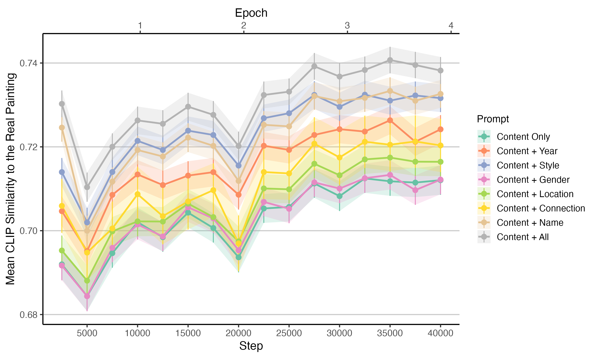

# Art_social_determinism

Codebase for the *Art Social Determinism* project, a collaborative research initiative between the **Max Planck Institute for Human Development (CHM)** and the **Knowledge Lab at the University of Chicago**.

## Research Intuition & Questions

**Is artistic form the result of personal agency or social constraint?**

1. **Humanities Perspective — The Individualistic View of Culture**: Culture arises from exceptional creativity and personal expression. (Kant, 1790;Nietzsche, 1872; Bloom, 1973)

2. **Social Sciences Perspective — The Collectivist View of Culture**: Culture is shaped by shared norms, institutions, and social structures. (Bourdieu, 1993; Becker, 1982; Geertz, 1973; Gorin et al., 2025)


## Current Research Pipeline


### 1. Prompt Construction  
*See:* [`code/prompt_making`](code/prompt_making)

Prompts are designed to simulate naturalistic image descriptions, combining both **content** and **style** elements:

a. **Content prompts**:  
Generated using *LLaVA v1.6* image captioning.
  
b. **Style prompts**:  
Synthesized from *Wikipedia texts* using *GPT-o3*.

Each image receives 5 unique prompts, combining:
__A randomly sampled content caption__ (different lengths) + ___N_ randomly sampled style attributes__ from: `name`, `year`, `style`, `gender`, `location`, `network`

### 2. Model Training via LoRA DreamBooth on Stable Diffusion 3  
*See:* [`code/training_script`](code/training_script)

Fine-tuning conducted using [LoRA](https://arxiv.org/abs/2106.09685) and [DreamBooth](https://arxiv.org/abs/2208.12242) on top of **Stable Diffusion 1.5**/**Stable Diffusion 3**, incorporating structured prompts.

### 3. Evaluation & Validation  
*See:* [`code/painting_test`](code/painting_test)

Evaluation conducted on a held-out sample of **2,000 paintings**, across varied prompt configurations to assess stylistic fidelity and representational realism.

Validation Results:

1. Quantitative validation



2. Qualitative validation: see folder [`imgs/painting_step35000`](imgs/painting_step35000)


### 4. Interactive Web Interface  
*See:* [`code/flask_interface`](code/flask_interface)

Flask-based demo app for conditional image generation using trained models. Supports structured input via selectable attributes.

Interface Snapshot:


## Next Steps

### 1. Enrich Metadata

a. **From existing data**:

Add attributes such as `age`, `education`, `nationality`, `religion`, and `parents’ background` (some require re-extraction).

b. **From external sources**:

Integrate contextual factors such as `wars`, `social movements`, or `political regimes` (requires historical database, for example [Correlates of War](https://correlatesofwar.org/data-sets/cow-war/)).

### 2. Model Extension to Stable Diffusion 1.5

SD 3 has a complex architecture which hard to capture detailed style changes. In a robustness check, SD 1.5 would be used under same prompt schemas.


## Future Directions

### 1. Tool Development

a. **Public-facing**:  
Educational and interactive tools for understanding how AI tools would influence opinions towards art.

b. **Expert-facing**:  
Interfaces for artist to use (more refinement required).

### 2. Quantifying Social Determinism in Art

Develop validation methods to assess how much of artistic form can be statistically explained by social variables.

Compare individual vs. structural contributions to aesthetic choices across time and geography.

## Requirements & Files

This project requires **Python 3.10+**.

To install all necessary Python packages, run:

```bash
pip install -r requirements.txt
```

All used files are saved directly to **MinIO** using an S3-compatible interface via `boto3`.  

Make sure the following environment variables are set: `MINIO_URL`, `MINIO_ACCESS_KEY`, `MINIO_SECRET_KEY`, `MINIO_BUCKET`